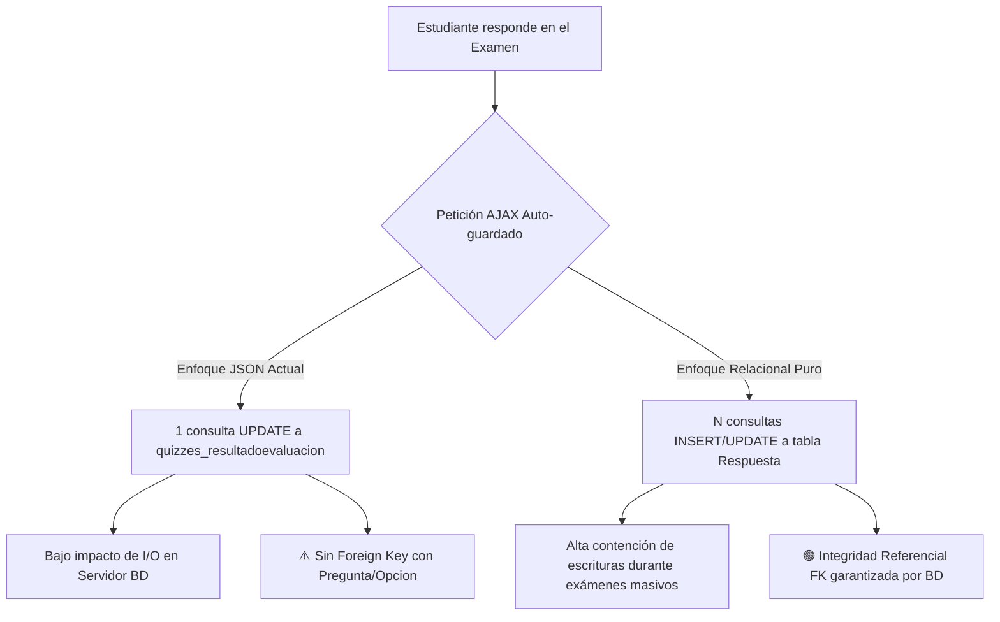
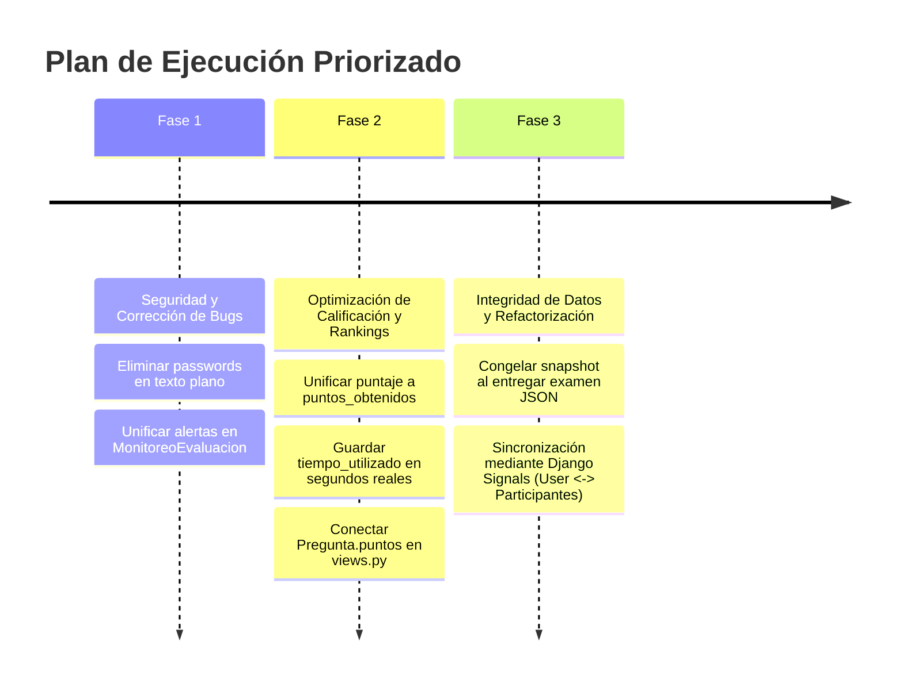

# Reporte Técnico y Exhaustivo de Análisis de Base de Datos (`bd_matholympmech`)

**Sistema:** TestMathUTEQ (Sistema de Gestión de Olimpiadas de Matemáticas UTEQ)  
**Base de datos dump:** `bd_matholympmech` (`docs/bd/bd-bd_matholympmech-202607242342.sql`)  
**Archivos de código contrastados:** 
- [models.py](file:///c:/Users/Alex2/Documents/Visual%20Code/Python/TestMathUTEQ/matholymp/quizzes/models.py)
- [views.py](file:///c:/Users/Alex2/Documents/Visual%20Code/Python/TestMathUTEQ/matholymp/quizzes/views.py)
- [email_utils.py](file:///c:/Users/Alex2/Documents/Visual%20Code/Python/TestMathUTEQ/matholymp/quizzes/email_utils.py)
- [admin.py](file:///c:/Users/Alex2/Documents/Visual%20Code/Python/TestMathUTEQ/matholymp/quizzes/admin.py)

---

## 1. Resumen Ejecutivo

Este informe presenta un **análisis técnico profundo y minucioso** de la base de datos `bd_matholympmech` perteneciente al proyecto **TestMathUTEQ**. El objetivo fundamental es evaluar cada decisión de diseño del esquema relacional **en función del código fuente real de la aplicación**. 

Cada una de las **27 tablas** presentes en el dump SQL ha sido auditada individualmente. Se identifican tanto los aciertos estructurales como las deficiencias, redundancias, riesgos de seguridad y fallos de lógica de negocio que podrían comprometer los flujos operativos de las olimpiadas.

### Resumen de Hallazgos Críticos:
1. **Triplicación y Desincronización de Puntajes (`quizzes_resultadoevaluacion`)**: Existen tres campos para el puntaje (`puntaje`, `puntos_obtenidos`, `puntos_totales`). Adicionalmente, el campo `Pregunta.puntos` se ignora por completo durante la calificación en `views.py` (se asigna 1 punto fijo por respuesta correcta).
2. **Evaluación Estratégica del Almacenamiento JSON (`respuestas_guardadas`)**: El uso de JSON para autosave es excelente para evitar cuellos de botella por I/O durante la prueba, pero carece de Integridad Referencial (FK), lo que genera vulnerabilidad a inconsistencias si se edita el banco de preguntas.
3. **Pérdida de Precisión en Criterios de Desempate (`tiempo_utilizado`)**: Al guardar el tiempo en minutos enteros (`// 60`), se generan empates artificiales que obligaron a programar algoritmos de ordenamiento pesados en memoria Python en lugar de delegarlos a MySQL.
4. **Vulnerabilidades Críticas de Seguridad (Texto Plano)**: Contraseñas temporales (`Participantes.password_temporal`) y de administradores (`AdminProfile.password`) almacenadas en texto plano en la base de datos.
5. **Bug de Visualización en Monitoreo (`quizzes_monitoreoevaluacion`)**: Incoherencia por duplicación entre `alertas` y `alertas_detectadas` que hace que la interfaz siempre reporte `0` alertas detectadas.
6. **Duplicación de Datos e Inexistencia de Sincronización**: Nombres, correos y cédulas duplicados entre `auth_user` y `quizzes_participantes` sin señales de actualización automática.

---

## 2. Análisis Técnico de Decisiones Arquitectónicas Globales

### 2.1 Análisis Inteligente: Almacenamiento de Respuestas en JSON (`respuestas_guardadas`)

En la tabla `quizzes_resultadoevaluacion`, las respuestas seleccionadas por los estudiantes se almacenan en una columna MySQL de tipo `JSON`:

```json
{
  "102": "415",
  "103": "418",
  "104": "422"
}
```
*(Donde la clave es el `pregunta_id` y el valor es el `opcion_id`)*.

#### ¿Es óptimo este diseño? (Análisis de Trade-offs)



#### Ventajas del Enfoque JSON Actual:
1. **Rendimiento Masivo en Tiempo Real**: Durante un examen concurrente con 500 estudiantes guardando respuestas cada 10 segundos, un simple `UPDATE` de 1 sola fila por intento mantiene la latencia de la base de datos cerca de cero.
2. **Flexibilidad para Selección Aleatoria de Preguntas**: Como cada estudiante recibe un subconjunto aleatorio de preguntas (`preguntas_a_mostrar`), el objeto JSON almacena únicamente las respuestas de las preguntas presentadas a ese participante sin requerir esquemas complejos.

#### Desventajas y Riesgos para el Flujo del Sistema:
1. **Falta de Integridad Referencial (Sin FK)**: Si un docente corrige una pregunta o elimina una opción en el panel administrativo mientras o después de un examen, el JSON mantiene IDs numéricos primitivos (`"102": "415"`). Al calificar en `views.py` ([views.py#L630](file:///c:/Users/Alex2/Documents/Visual%20Code/Python/TestMathUTEQ/matholymp/quizzes/views.py#L630)), `opciones.filter(id=415)` no encuentra el registro, marcando la pregunta como incorrecta silenciosamente o lanzando una excepción.
2. **Sobrescritura por Concurrencia AJAX**: Si la conexión a internet del estudiante vacila y se envían dos peticiones de auto-guardado desordenadas, la segunda respuesta puede sobrescribir el objeto JSON completo con un estado previo del examen.
3. **Analíticas Complejas e Ineficientes**: Responder preguntas de gestión como *"¿Cuál es la pregunta más difícil del concurso?"* requiere cargar todos los objetos JSON a la memoria de Python e iterar uno por uno, imposibilitando el uso de `GROUP BY` rápido indexado en MySQL.

#### 💡 Solución Recomendada (Modelo Híbrido):
> [!TIP]
> **No eliminar la columna JSON**. Mantener `respuestas_guardadas` para el autosave ágil mientras el examen esté en progreso (`completada=False`). Al momento en que el usuario presiona "Finalizar Examen" (`completada=True`), generar un snapshot relacional o inmutable con los textos reales de las preguntas y respuestas elegidas. Esto protege los resultados históricos contra borrados accidentales en el banco de preguntas.

---

### 2.2 El Caso del Puntaje: Error Garrafal de Redundancia y Desincronización

En la tabla `quizzes_resultadoevaluacion`, coexisten tres columnas relacionales para la nota:
- `puntaje`: `decimal(5,2)` (Ej: `85.00` - Porcentaje $0-100\%$)
- `puntos_obtenidos`: `decimal(5,3)` (Ej: `8.500` - Nota ponderada sobre 10)
- `puntos_totales`: `int unsigned` (Ej: `10` - Escala fija)

#### Evidencia del Error en el Código Fuente:
1. **Fórmulas Cruzadas**: En `views.py` ([views.py#L650](file:///c:/Users/Alex2/Documents/Visual%20Code/Python/TestMathUTEQ/matholymp/quizzes/views.py#L650)):
   ```python
   puntaje_ponderado = (puntos_obtenidos / total_questions) * 10
   resultado_activo.puntaje = (puntaje_ponderado / 10) * 100
   resultado_activo.puntos_obtenidos = puntaje_ponderado
   resultado_activo.puntos_totales = 10
   ```
2. **Desincronización en Rankings**:
   - `ResultadoEvaluacion.Meta` especifica: `ordering = ['-puntaje', 'tiempo_utilizado']`.
   - En `models.py` ([models.py#L506](file:///c:/Users/Alex2/Documents/Visual%20Code/Python/TestMathUTEQ/matholymp/quizzes/models.py#L506)), las funciones `get_participantes_etapa2()` y `get_participantes_etapa3()` obtienen los clasificados filtrando por `Max('puntos_obtenidos')`.
   - Si se ajusta un puntaje manualmente o falla una actualización, una vista mostrará un orden en pantalla y la base de datos clasificará a otros participantes.
3. **El Campo Ignorado `Pregunta.puntos`**:
   - La tabla `quizzes_pregunta` posee la columna `puntos` (default `1`).
   - Sin embargo, la lógica de evaluación en `views.py` suma siempre `+1` por cada respuesta correcta, ignorando el valor del campo `puntos`. Si un docente le asigna 5 puntos a un ejercicio complejo de olimpiadas, el sistema lo califica exactamente igual que una pregunta sencilla de 1 punto.

---

### 2.3 Precisión Temporal en Criterios de Desempate (`tiempo_utilizado`)

- `ResultadoEvaluacion.tiempo_utilizado` almacena un entero que representa **minutos truncados sin segundos** (`tiempo_total // 60`).
- En el reglamento de olimpiadas, si dos participantes empatan en puntaje, gana quien haya resuelto la prueba en el menor tiempo posible (medido en segundos).
- Al truncar los segundos en la base de datos, dos estudiantes con tiempos de 12 min 05 seg y 12 min 55 seg reciben el mismo valor `12`.
- **Efecto Secundario en Código**: Los desarrolladores se vieron obligados a escribir bucles Python en `models.py` ([models.py#L530](file:///c:/Users/Alex2/Documents/Visual%20Code/Python/TestMathUTEQ/matholymp/quizzes/models.py#L530)) iterando registro por registro para calcular `(fecha_fin - fecha_inicio).total_seconds()`. Al cambiar `tiempo_utilizado` a segundos reales en la BD, la base de datos ordenará instantáneamente con `ORDER BY puntos_obtenidos DESC, tiempo_utilizado ASC`.

---

### 2.4 Seguridad Crítica: Contraseñas en Texto Plano

- `quizzes_participantes.password_temporal` (Varchar 50): Guarda la contraseña en texto claro.
- `quizzes_adminprofile.password` (Varchar 50): Guarda la contraseña del administrador en texto claro.

> [!CAUTION]
> Guardar credenciales en texto plano expone el sistema a filtraciones masivas si se realiza una copia de seguridad de la BD (como el archivo SQL analizado). Las contraseñas temporales se deben enviar por correo electrónico y ser desechadas, nunca almacenadas de forma persistente sin cifrado hash.

---

### 2.5 Incoherencia en Monitoreo (`quizzes_monitoreoevaluacion`)

Existen dos columnas JSON en la tabla `quizzes_monitoreoevaluacion`:
- `alertas_detectadas` (`json`)
- `alertas` (`json`)

**Bug Activo en `views.py`**:
En la función `actualizar_monitoreo()` ([views.py#L5010](file:///c:/Users/Alex2/Documents/Visual%20Code/Python/TestMathUTEQ/matholymp/quizzes/views.py#L5010)), el servidor registra los eventos de cambio de pestaña haciendo:
```python
monitoreo.alertas.append({'tipo': 'cambio_pestana', ...})
```
Pero en la línea siguiente calcula la respuesta para la interfaz web haciendo:
```python
'alertas_count': len(monitoreo.alertas_detectadas)
```
Dado que el código escribe en `alertas` pero cuenta `alertas_detectadas`, el conteo de alertas siempre retorna `0` en el panel de monitoreo del administrador.

---

## 3. Análisis Exhaustivo Ficha por Ficha de las 27 Tablas

A continuación se detalla la auditoría completa por tabla, cubriendo tanto las que presentan anomalías como las que están perfectamente diseñadas:

---

### 📌 Tablas del Módulo Core y Autenticación (Django Standard)

#### 1. Tabla: `auth_group`
* **Modelo Django**: `django.contrib.auth.models.Group`
* **Columnas SQL**: `id` (int, PK), `name` (varchar 150, Unique).
* **Propósito**: Almacenamiento de grupos de permisos del sistema de autenticación nativo de Django.
* **Evidencia en Código**: No se registran referencias directas en [views.py](file:///c:/Users/Alex2/Documents/Visual%20Code/Python/TestMathUTEQ/matholymp/quizzes/views.py) ni [models.py](file:///c:/Users/Alex2/Documents/Visual%20Code/Python/TestMathUTEQ/matholymp/quizzes/models.py). Los roles de administración se controlan mediante `AdminProfile` y banderas `is_superuser`/`is_staff`.
* **Diagnóstico**: 🟢 **Sin Errores / Bien Diseñada (Nativa de Django)**.
* **Impacto**: Ninguno. Estructura estándar del framework.
* **Recomendación**: Conservar intacta por compatibilidad con el panel de administración.

---

#### 2. Tabla: `auth_group_permissions`
* **Modelo Django**: Tabla intermedia Many-to-Many nativa de Django.
* **Columnas SQL**: `id` (int, PK), `group_id` (int, FK), `permission_id` (int, FK).
* **Propósito**: Relacionar grupos con permisos específicos.
* **Evidencia en Código**: Tabla vacía sin uso explícito en las vistas del concurso.
* **Diagnóstico**: 🟢 **Sin Errores / Estructura Limpia**.
* **Impacto**: Ninguno.
* **Recomendación**: Conservar intacta.

---

#### 3. Tabla: `auth_permission`
* **Modelo Django**: `django.contrib.auth.models.Permission`
* **Columnas SQL**: `id` (int, PK), `name` (varchar 255), `content_type_id` (int, FK), `codename` (varchar 100).
* **Propósito**: Registro de permisos granulares autogenerados por Django para cada modelo (`add_evaluacion`, `change_participantes`, etc.).
* **Evidencia en Código**: Utilizado internamente por los decoradores `@permission_required` y la administración de Django.
* **Diagnóstico**: 🟢 **Sin Errores / Correcta**.
* **Impacto**: Crítico para el funcionamiento de permisos del framework.
* **Recomendación**: Conservar sin modificaciones.

---

#### 4. Tabla: `auth_user`
* **Modelo Django**: `django.contrib.auth.models.User`
* **Columnas SQL**: `id` (int, PK), `password` (varchar 128), `last_login` (datetime), `is_superuser` (tinyint 1), `username` (varchar 150, Unique), `first_name` (varchar 150), `last_name` (varchar 150), `email` (varchar 254), `is_staff` (tinyint 1), `is_active` (tinyint 1), `date_joined` (datetime).
* **Propósito**: Entidad principal de autenticación (usuarios, administradores y participantes).
* **Evidencia en Código**: Usada en `custom_login()` ([views.py#L112](file:///c:/Users/Alex2/Documents/Visual%20Code/Python/TestMathUTEQ/matholymp/quizzes/views.py#L112)) y en la creación de participantes (`Participantes.create_participant()` en [models.py#L377](file:///c:/Users/Alex2/Documents/Visual%20Code/Python/TestMathUTEQ/matholymp/quizzes/models.py#L377)).
* **Diagnóstico**: ⚠️ **Redundancia de Datos**. Los datos `username` (cédula), `email` y `first_name` están duplicados en la tabla `quizzes_participantes`.
* **Impacto**: Si un administrador modifica el correo de un estudiante en `auth_user`, `quizzes_participantes.email` no se actualiza, generando fallos en el envío de diplomas y notificaciones.
* **Recomendación**: **Conservar como fuente de verdad para el login**. Implementar señales Django (`post_save`) para sincronizar automáticamente ambas tablas.

---

#### 5. Tabla: `auth_user_groups`
* **Modelo Django**: Tabla intermedia Many-to-Many nativa de Django.
* **Columnas SQL**: `id` (int, PK), `user_id` (int, FK), `group_id` (int, FK).
* **Propósito**: Asignación de grupos a usuarios.
* **Evidencia en Código**: Sin uso activo.
* **Diagnóstico**: 🟢 **Sin Errores**.
* **Recomendación**: Conservar.

---

#### 6. Tabla: `auth_user_user_permissions`
* **Modelo Django**: Tabla intermedia Many-to-Many nativa de Django.
* **Columnas SQL**: `id` (int, PK), `user_id` (int, FK), `permission_id` (int, FK).
* **Propósito**: Permisos directos asignados a un usuario específico.
* **Evidencia en Código**: Sin uso explícito.
* **Diagnóstico**: 🟢 **Sin Errores**.
* **Recomendación**: Conservar.

---

#### 7. Tabla: `django_admin_log`
* **Modelo Django**: `django.contrib.admin.models.LogEntry`
* **Columnas SQL**: `id` (int, PK), `action_time` (datetime), `object_id` (longtext), `object_repr` (varchar 200), `action_flag` (smallint), `change_message` (longtext), `content_type_id` (int, FK), `user_id` (int, FK).
* **Propósito**: Historial de auditoría para cambios realizados en el panel administrativo `/admin/`.
* **Evidencia en Código**: Operada automáticamente por Django Admin.
* **Diagnóstico**: 🟢 **Sin Errores / Bien Diseñada**.
* **Recomendación**: Conservar.

---

#### 8. Tabla: `django_content_type`
* **Modelo Django**: `django.contrib.contenttypes.models.ContentType`
* **Columnas SQL**: `id` (int, PK), `app_label` (varchar 100), `model` (varchar 100).
* **Propósito**: Mapeo interno entre la estructura de clases Python y las tablas de MySQL.
* **Evidencia en Código**: Utilizada por el ORM de Django para relaciones genéricas.
* **Diagnóstico**: 🟢 **Sin Errores / Esencial**.
* **Recomendación**: Conservar.

---

#### 9. Tabla: `django_migrations`
* **Modelo Django**: Interno de Django Migrations.
* **Columnas SQL**: `id` (int, PK), `app` (varchar 255), `name` (varchar 255), `applied` (datetime).
* **Propósito**: Control de versiones y estado del esquema de la BD (registra las 48 migraciones aplicadas).
* **Evidencia en Código**: Administrada mediante `python manage.py migrate`.
* **Diagnóstico**: 🟢 **Sin Errores / Correcta**.
* **Recomendación**: Conservar intacta.

---

#### 10. Tabla: `django_session`
* **Modelo Django**: `django.contrib.sessions.models.Session`
* **Columnas SQL**: `session_key` (varchar 40, PK), `session_data` (longtext), `expire_date` (datetime, Index).
* **Propósito**: Almacenamiento de cookies y estado de sesión HTTP de usuarios conectados.
* **Evidencia en Código**: Usada en `custom_login()` y `session_check()` ([views.py#L162](file:///c:/Users/Alex2/Documents/Visual%20Code/Python/TestMathUTEQ/matholymp/quizzes/views.py#L162)).
* **Diagnóstico**: 🟢 **Sin Errores**.
* **Recomendación**: Conservar. Se sugiere programar una tarea cron para ejecutar `python manage.py clearsessions` y liberar memoria de sesiones expiradas.

---

### 📌 Tablas del Dominio Quizzes (Modelos de la Aplicación)

#### 11. Tabla: `quizzes_adminprofile`
* **Modelo Django**: `AdminProfile` ([models.py#L240](file:///c:/Users/Alex2/Documents/Visual%20Code/Python/TestMathUTEQ/matholymp/quizzes/models.py#L240))
* **Columnas SQL**: `id` (bigint, PK), `password` (varchar 50), `created_by_id` (int, FK, Nullable), `user_id` (int, FK, Unique), `acceso_total` (tinyint 1).
* **Propósito**: Perfil diferenciador para administradores secundarios creados por el superadministrador.
* **Evidencia en Código**: Utilizado en `manage_admins()` ([views.py#L1121](file:///c:/Users/Alex2/Documents/Visual%20Code/Python/TestMathUTEQ/matholymp/quizzes/views.py#L1121)).
* **Diagnóstico**: ❌ **Vulnerabilidad Crítica de Seguridad**. La columna `password` almacena la contraseña del administrador en **texto plano**.
* **Impacto**: Riesgo grave de fuga de contraseñas de administración si el respaldo SQL llega a manos no autorizadas.
* **Recomendación**: **Eliminar la columna `password`**. Las credenciales deben ser enviadas por correo mediante enlace seguro o hash temporal de un solo uso.

---

#### 12. Tabla: `quizzes_categoria`
* **Modelo Django**: `Categoria` ([models.py#L803](file:///c:/Users/Alex2/Documents/Visual%20Code/Python/TestMathUTEQ/matholymp/quizzes/models.py#L803))
* **Columnas SQL**: `id` (bigint, PK), `nombre` (varchar 100, Unique), `descripcion` (longtext), `fecha_creacion` (datetime), `activa` (tinyint 1).
* **Propósito**: Clasificar las preguntas por temas (Álgebra, Geometría Analítica, Combinatoria, etc.).
* **Evidencia en Código**: Manejada en las vistas `crear_categoria()`, `editar_categoria()` ([views.py#L5489](file:///c:/Users/Alex2/Documents/Visual%20Code/Python/TestMathUTEQ/matholymp/quizzes/views.py#L5489)).
* **Diagnóstico**: 🟢 **Sin Errores / Excelente Diseño**. Tabla limpia, indexada y bien parametrizada.
* **Impacto**: Facilita la organización del banco de preguntas.
* **Recomendación**: Conservar tal cual está.

---

#### 13. Tabla: `quizzes_evaluacion`
* **Modelo Django**: `Evaluacion` ([models.py#L401](file:///c:/Users/Alex2/Documents/Visual%20Code/Python/TestMathUTEQ/matholymp/quizzes/models.py#L401))
* **Columnas SQL**: `id` (bigint, PK), `title` (varchar 200), `start_time` (datetime), `duration_minutes` (int unsigned), `end_time` (datetime), `etapa` (int), `preguntas_a_mostrar` (int unsigned), `anio` (int).
* **Propósito**: Definición del examen de la olimpiada (fechas de acceso, duración, etapa clasificatoria o final, número de preguntas aleatorias).
* **Evidencia en Código**: Usada en la vista principal del examen `take_quiz()` ([views.py#L170](file:///c:/Users/Alex2/Documents/Visual%20Code/Python/TestMathUTEQ/matholymp/quizzes/views.py#L170)) y para validar restricciones de tiempo `is_available()` ([models.py#L428](file:///c:/Users/Alex2/Documents/Visual%20Code/Python/TestMathUTEQ/matholymp/quizzes/models.py#L428)).
* **Diagnóstico**: 🟢 **Sin Errores / Estructura Robusta**.
* **Impacto**: Es la entidad central de la que dependen preguntas y resultados.
* **Recomendación**: Conservar. Es uno de los modelos mejor estructurados del sistema.

---

#### 14. Tabla: `quizzes_evaluacion_grupos_participantes`
* **Modelo Django**: Tabla intermedia Many-to-Many entre `Evaluacion` y `GrupoParticipantes`.
* **Columnas SQL**: `id` (int, PK), `evaluacion_id` (bigint, FK), `grupoparticipantes_id` (bigint, FK).
* **Propósito**: Asignar instituciones educativas completas (grupos) a una evaluación de Etapa 1.
* **Evidencia en Código**: Consultada en `get_participantes_etapa1()` ([models.py#L470](file:///c:/Users/Alex2/Documents/Visual%20Code/Python/TestMathUTEQ/matholymp/quizzes/models.py#L470)).
* **Diagnóstico**: 🟢 **Sin Errores / Bien Diseñada**.
* **Recomendación**: Conservar.

---

#### 15. Tabla: `quizzes_evaluacion_participantes_individuales`
* **Modelo Django**: Tabla intermedia Many-to-Many entre `Evaluacion` y `Participantes`.
* **Columnas SQL**: `id` (int, PK), `evaluacion_id` (bigint, FK), `participantes_id` (bigint, FK).
* **Propósito**: Asignar participantes específicos de manera individual a evaluaciones de Etapa 2 o Etapa 3.
* **Evidencia en Código**: Consultada en `get_participantes_autorizados()` ([models.py#L724](file:///c:/Users/Alex2/Documents/Visual%20Code/Python/TestMathUTEQ/matholymp/quizzes/models.py#L724)).
* **Diagnóstico**: 🟢 **Sin Errores / Correcta**.
* **Recomendación**: Conservar.

---

#### 16. Tabla: `quizzes_grupoparticipantes`
* **Modelo Django**: `GrupoParticipantes` ([models.py#L214](file:///c:/Users/Alex2/Documents/Visual%20Code/Python/TestMathUTEQ/matholymp/quizzes/models.py#L214))
* **Columnas SQL**: `id` (bigint, PK), `name` (varchar 100), `representante_id` (bigint, FK, Nullable), `anio` (int).
* **Propósito**: Agrupar estudiantes bajo la supervisión de un docente o colegio.
* **Evidencia en Código**: Manejada en `manage_grupos()` ([views.py#L1555](file:///c:/Users/Alex2/Documents/Visual%20Code/Python/TestMathUTEQ/matholymp/quizzes/views.py#L1555)).
* **Diagnóstico**: 🟢 **Sin Errores / Bien Diseñada**.
* **Recomendación**: Conservar.

---

#### 17. Tabla: `quizzes_grupoparticipantes_participantes`
* **Modelo Django**: Tabla intermedia Many-to-Many entre `GrupoParticipantes` y `Participantes`.
* **Columnas SQL**: `id` (int, PK), `grupoparticipantes_id` (bigint, FK), `participantes_id` (bigint, FK).
* **Propósito**: Relacionar los estudiantes pertenecientes a cada grupo colegial.
* **Evidencia en Código**: Utilizada intensivamente para inscripciones masivas.
* **Diagnóstico**: 🟢 **Sin Errores / Correcta**.
* **Recomendación**: Conservar.

---

#### 18. Tabla: `quizzes_intentosparticipante`
* **Modelo Django**: `IntentosParticipante` ([models.py#L250](file:///c:/Users/Alex2/Documents/Visual%20Code/Python/TestMathUTEQ/matholymp/quizzes/models.py#L250))
* **Columnas SQL**: `id` (bigint, PK), `intentos_maximos` (int unsigned), `fecha_asignacion` (datetime), `motivo` (longtext), `creado_por_id` (int, FK, Nullable), `evaluacion_id` (bigint, FK), `participante_id` (bigint, FK).
* **Propósito**: Configurar reintentos excepcionales para un estudiante específico en una evaluación concreta.
* **Evidencia en Código**: Consultada en `Participantes.get_intentos_disponibles()` ([models.py#L307](file:///c:/Users/Alex2/Documents/Visual%20Code/Python/TestMathUTEQ/matholymp/quizzes/models.py#L307)) y administrada en `dar_nuevo_intento_evaluacion()` ([views.py#L5643](file:///c:/Users/Alex2/Documents/Visual%20Code/Python/TestMathUTEQ/matholymp/quizzes/views.py#L5643)).
* **Diagnóstico**: 🟢 **Sin Errores / Excelente Arquitectura**. Posee restricción de unicidad compuesta `unique_together = ['participante', 'evaluacion']`.
* **Recomendación**: Conservar intacta.

---

#### 19. Tabla: `quizzes_monitoreoevaluacion`
* **Modelo Django**: `MonitoreoEvaluacion` ([models.py#L929](file:///c:/Users/Alex2/Documents/Visual%20Code/Python/TestMathUTEQ/matholymp/quizzes/models.py#L929))
* **Columnas SQL**: `id` (bigint, PK), `estado` (varchar 20), `ultima_actividad` (datetime), `tiempo_activo` (int unsigned), `tiempo_inactivo` (int unsigned), `pagina_actual` (int unsigned), `preguntas_respondidas` (int unsigned), `preguntas_revisadas` (int unsigned), `alertas_detectadas` (json), `irregularidades` (longtext), `motivo_finalizacion` (longtext), `fecha_finalizacion_admin` (datetime, Nullable), `fecha_inicio_monitoreo` (datetime), `fecha_ultima_actualizacion` (datetime), `evaluacion_id` (bigint, FK), `finalizado_por_admin_id` (int, FK, Nullable), `participante_id` (bigint, FK), `resultado_id` (bigint, FK, Nullable), `alertas` (json), `cambios_pestana` (int unsigned).
* **Propósito**: Control de presencia y monitoreo en tiempo real durante la rendición del examen.
* **Evidencia en Código**: Usada en `actualizar_monitoreo()` ([views.py#L5000](file:///c:/Users/Alex2/Documents/Visual%20Code/Python/TestMathUTEQ/matholymp/quizzes/views.py#L5000)).
* **Diagnóstico**: ❌ **Incoherencia y Bug Activo en Código**. Coexisten las columnas JSON `alertas_detectadas` y `alertas`. En [views.py#L5010](file:///c:/Users/Alex2/Documents/Visual%20Code/Python/TestMathUTEQ/matholymp/quizzes/views.py#L5010) se escriben los eventos en `alertas` pero se calcula la longitud de `alertas_detectadas`, por lo que el conteo en pantalla siempre devuelve `0`.
* **Impacto**: Desinforma al docente administrador sobre las faltas del estudiante.
* **Recomendación**: **Refactorizar**. Eliminar la columna duplicada `alertas` mediante una migración y unificar la lógica en `alertas_detectadas`.

---

#### 20. Tabla: `quizzes_opcion`
* **Modelo Django**: `Opcion` ([models.py#L828](file:///c:/Users/Alex2/Documents/Visual%20Code/Python/TestMathUTEQ/matholymp/quizzes/models.py#L828))
* **Columnas SQL**: `id` (bigint, PK), `text` (longtext), `is_correct` (tinyint 1), `pregunta_id` (bigint, FK).
* **Propósito**: Almacenar las opciones de respuesta asociadas a cada pregunta.
* **Evidencia en Código**: Usada en la calificación en `views.py` ([views.py#L630](file:///c:/Users/Alex2/Documents/Visual%20Code/Python/TestMathUTEQ/matholymp/quizzes/views.py#L630)) verificando `is_correct=True`. Soporta código LaTeX.
* **Diagnóstico**: 🟢 **Sin Errores / Bien Diseñada**.
* **Recomendación**: Conservar intacta.

---

#### 21. Tabla: `quizzes_participantes`
* **Modelo Django**: `Participantes` ([models.py#L273](file:///c:/Users/Alex2/Documents/Visual%20Code/Python/TestMathUTEQ/matholymp/quizzes/models.py#L273))
* **Columnas SQL**: `id` (bigint, PK), `cedula` (varchar 10, Unique), `email` (varchar 254, Unique), `phone` (varchar 10), `edad` (int, Nullable), `user_id` (int, FK, Unique), `NombresCompletos` (varchar 200), `password_temporal` (varchar 50), `intentos_maximos_default` (int unsigned).
* **Propósito**: Perfil detallado del estudiante participante en el concurso.
* **Evidencia en Código**: Usada en el registro e importación masiva desde Excel `save_excel_participants()` ([views.py#L1771](file:///c:/Users/Alex2/Documents/Visual%20Code/Python/TestMathUTEQ/matholymp/quizzes/views.py#L1771)).
* **Diagnóstico**: ⚠️ **Riesgo de Seguridad y Duplicación de Datos**.
  1. `password_temporal` guarda contraseñas en texto claro.
  2. `cedula`, `email` y `NombresCompletos` están duplicados con `auth_user`.
* **Impacto**: Inconsistencia de datos entre cuentas si no se actualizan ambas tablas en simultáneo.
* **Recomendación**: Purgar `password_temporal` e implementar señales `post_save` de Django para sincronizar los datos de perfil con `auth_user`.

---

#### 22. Tabla: `quizzes_pregunta`
* **Modelo Django**: `Pregunta` ([models.py#L818](file:///c:/Users/Alex2/Documents/Visual%20Code/Python/TestMathUTEQ/matholymp/quizzes/models.py#L818))
* **Columnas SQL**: `id` (bigint, PK), `text` (longtext), `evaluacion_id` (bigint, FK), `puntos` (int unsigned), `categoria_id` (bigint, FK, Nullable).
* **Propósito**: Preguntas o reactivos pertenecientes a una evaluación.
* **Evidencia en Código**: Usada en `manage_questions()` ([views.py#L2047](file:///c:/Users/Alex2/Documents/Visual%20Code/Python/TestMathUTEQ/matholymp/quizzes/views.py#L2047)).
* **Diagnóstico**: ⚠️ **Incoherencia en Lógica de Negocio**. El campo `puntos` (por defecto 1) es ignorado por completo durante el proceso de calificación en `views.py` ([views.py#L625](file:///c:/Users/Alex2/Documents/Visual%20Code/Python/TestMathUTEQ/matholymp/quizzes/views.py#L625)), donde se asigna 1 punto uniforme por respuesta correcta.
* **Impacto**: Los profesores pueden configurar diferente puntaje por pregunta en la interfaz de edición, pero en el examen real todas las preguntas se promedian por igual.
* **Recomendación**: Modificar la función de calificación en `views.py` para ponderar cada respuesta según `pregunta.puntos`.

---

#### 23. Tabla: `quizzes_representante`
* **Modelo Django**: `Representante` ([models.py#L167](file:///c:/Users/Alex2/Documents/Visual%20Code/Python/TestMathUTEQ/matholymp/quizzes/models.py#L167))
* **Columnas SQL**: `id` (bigint, PK), `NombreColegio` (varchar 200), `DireccionColegio` (varchar 300), `TelefonoInstitucional` (varchar 10), `CorreoInstitucional` (varchar 254), `NombresRepresentante` (varchar 200), `TelefonoRepresentante` (varchar 10), `CorreoRepresentante` (varchar 254), `anio` (int).
* **Propósito**: Registro de los docentes coordinadores y colegios participantes por cada año del concurso.
* **Evidencia en Código**: Manejada en `manage_representantes()` ([views.py#L1360](file:///c:/Users/Alex2/Documents/Visual%20Code/Python/TestMathUTEQ/matholymp/quizzes/views.py#L1360)). Posee restricciones compuestas: `unique_correo_institucional_por_anio` y `unique_correo_representante_por_anio`.
* **Diagnóstico**: 🟢 **Sin Errores / Excelente Diseño Relacional**.
* **Impacto**: Garantiza la trazabilidad por año de los colegios inscritos.
* **Recomendación**: Conservar tal como está.

---

#### 24. Tabla: `quizzes_resultadoevaluacion`
* **Modelo Django**: `ResultadoEvaluacion` ([models.py#L837](file:///c:/Users/Alex2/Documents/Visual%20Code/Python/TestMathUTEQ/matholymp/quizzes/models.py#L837))
* **Columnas SQL**: `id` (bigint, PK), `puntaje` (decimal 5,2), `tiempo_utilizado` (int unsigned), `fecha_inicio` (datetime), `fecha_fin` (datetime, Nullable), `completada` (tinyint 1), `evaluacion_id` (bigint, FK), `participante_id` (bigint, FK), `respuestas_guardadas` (json), `tiempo_restante` (int unsigned), `ultima_actividad` (datetime), `puntos_obtenidos` (decimal 5,3), `puntos_totales` (int unsigned), `numero_intento` (int unsigned), `cambios_pestana` (int unsigned).
* **Propósito**: Registro histórico del intento, respuestas, tiempos y calificaciones del estudiante.
* **Evidencia en Código**: Usada en `evaluacion_results()`, `ranking_evaluacion()` ([views.py#L3024](file:///c:/Users/Alex2/Documents/Visual%20Code/Python/TestMathUTEQ/matholymp/quizzes/views.py#L3024)).
* **Diagnóstico**: ❌ **Inconsistencias Severas y Deficiencia Temporal**.
  1. Triplicación innecesaria de campos de nota (`puntaje`, `puntos_obtenidos`, `puntos_totales`).
  2. `tiempo_utilizado` trunca los segundos, arruinando los criterios de desempate en la BD y obligando a hacer cálculos pesados en Python.
* **Impacto**: Genera ralentización en la generación de rankings y posibles discrepancias en los clasificados a las siguientes etapas.
* **Recomendación**:
  - Eliminar el campo `puntaje` y usar `puntos_obtenidos` como única fuente de nota sobre 10.
  - Guardar `tiempo_utilizado` en segundos exactos.

---

#### 25. Tabla: `quizzes_solicitudclavetemporal`
* **Modelo Django**: `SolicitudClaveTemporal` ([models.py#L1088](file:///c:/Users/Alex2/Documents/Visual%20Code/Python/TestMathUTEQ/matholymp/quizzes/models.py#L1088))
* **Columnas SQL**: `id` (bigint, PK), `username` (varchar 150), `tipo_usuario` (varchar 20), `email` (varchar 254), `fecha_solicitud` (datetime), `procesada` (tinyint 1), `mensaje_error` (longtext).
* **Propósito**: Auditoría y tasa límite para recuperación de clave (máximo 3 solicitudes semanales).
* **Evidencia en Código**: Consultada en `SolicitudClaveTemporal.puede_solicitar()` ([models.py#L1135](file:///c:/Users/Alex2/Documents/Visual%20Code/Python/TestMathUTEQ/matholymp/quizzes/models.py#L1135)) y gestionada en `solicitar_clave_temporal()` ([views.py#L5337](file:///c:/Users/Alex2/Documents/Visual%20Code/Python/TestMathUTEQ/matholymp/quizzes/views.py#L5337)).
* **Diagnóstico**: 🟢 **Sin Errores / Diseño Eficiente**. Posee índices compuestos para búsquedas rápidas por usuario y fecha.
* **Recomendación**: Conservar intacta.

---

#### 26. Tabla: `quizzes_systemconfig`
* **Modelo Django**: `SystemConfig` ([models.py#L12](file:///c:/Users/Alex2/Documents/Visual%20Code/Python/TestMathUTEQ/matholymp/quizzes/models.py#L12))
* **Columnas SQL**: `id` (bigint, PK), `num_etapas` (int), `active_year` (int).
* **Propósito**: Configurar los parámetros globales del concurso ($2$ o $3$ etapas y año activo).
* **Evidencia en Código**: Consultada en `SystemConfig.get_num_etapas()` ([models.py#L27](file:///c:/Users/Alex2/Documents/Visual%20Code/Python/TestMathUTEQ/matholymp/quizzes/models.py#L27)).
* **Diagnóstico**: ⚠️ **Falta Restricción Singleton**. Funciona por convención de tomar el primer registro (`cls.objects.first()`), pero no prohíbe en la BD la inserción accidental de múltiples filas.
* **Recomendación**: Agregar una validación en el método `save()` para restringir la tabla a una única fila (`id=1`).

---

#### 27. Tabla: `quizzes_userprofile`
* **Modelo Django**: `UserProfile` ([models.py#L224](file:///c:/Users/Alex2/Documents/Visual%20Code/Python/TestMathUTEQ/matholymp/quizzes/models.py#L224))
* **Columnas SQL**: `id` (bigint, PK), `avatar` (varchar 100, Nullable), `phone` (varchar 10), `bio` (longtext), `fecha_actualizacion` (datetime), `user_id` (int, FK, Unique).
* **Propósito**: Guardar la foto de perfil (avatar), biografía y teléfono del usuario.
* **Evidencia en Código**: Usada en `profile_view()` ([views.py#L4027](file:///c:/Users/Alex2/Documents/Visual%20Code/Python/TestMathUTEQ/matholymp/quizzes/views.py#L4027)).
* **Diagnóstico**: ⚠️ **Redundancia de Teléfono**. El campo `phone` en `UserProfile` duplica el campo `phone` de la tabla `quizzes_participantes`.
* **Recomendación**: Usar `UserProfile` exclusivamente para avatares e información personal no crítica de la cuenta.

---

## 4. Matriz Resumen Comparativa de las 27 Tablas

| # | Nombre de la Tabla SQL | Modelo Django | Estado / Diagnóstico | Nivel de Riesgo | Acción Sugerida |
| :---: | :--- | :--- | :---: | :---: | :--- |
| 1 | `auth_group` | `Group` | 🟢 Correcta | Nulo | Conservar (Django Std) |
| 2 | `auth_group_permissions` | M2M Groups | 🟢 Correcta | Nulo | Conservar (Django Std) |
| 3 | `auth_permission` | `Permission` | 🟢 Correcta | Nulo | Conservar (Django Std) |
| 4 | `auth_user` | `User` | ⚠️ Datos Duplicados | Medio | Conservar. Añadir Signals con `Participantes` |
| 5 | `auth_user_groups` | M2M User-Groups | 🟢 Correcta | Nulo | Conservar (Django Std) |
| 6 | `auth_user_user_permissions` | M2M User-Perms | 🟢 Correcta | Nulo | Conservar (Django Std) |
| 7 | `django_admin_log` | `LogEntry` | 🟢 Correcta | Nulo | Conservar (Django Std) |
| 8 | `django_content_type` | `ContentType` | 🟢 Correcta | Nulo | Conservar (Django Std) |
| 9 | `django_migrations` | Migrations | 🟢 Correcta | Nulo | Conservar intacta |
| 10 | `django_session` | `Session` | 🟢 Correcta | Bajo | Ejecutar `clearsessions` periódico |
| 11 | `quizzes_adminprofile` | `AdminProfile` | ❌ Clave Texto Plano | **ALTO** | Eliminar campo `password` |
| 12 | `quizzes_categoria` | `Categoria` | 🟢 Excelente | Nulo | Conservar |
| 13 | `quizzes_evaluacion` | `Evaluacion` | 🟢 Robusta | Nulo | Conservar |
| 14 | `quizzes_evaluacion_grupos_participantes` | M2M Eval-Grupos | 🟢 Correcta | Nulo | Conservar |
| 15 | `quizzes_evaluacion_participantes_individuales` | M2M Eval-Indiv | 🟢 Correcta | Nulo | Conservar |
| 16 | `quizzes_grupoparticipantes` | `GrupoParticipantes` | 🟢 Correcta | Nulo | Conservar |
| 17 | `quizzes_grupoparticipantes_participantes` | M2M Grupo-Part | 🟢 Correcta | Nulo | Conservar |
| 18 | `quizzes_intentosparticipante` | `IntentosParticipante` | 🟢 Excelente | Nulo | Conservar |
| 19 | `quizzes_monitoreoevaluacion` | `MonitoreoEvaluacion` | ❌ Bug en Alertas | **ALTO** | Eliminar `alertas` y usar `alertas_detectadas` |
| 20 | `quizzes_opcion` | `Opcion` | 🟢 Correcta | Nulo | Conservar |
| 21 | `quizzes_participantes` | `Participantes` | ⚠️ Clave Texto Plano | **ALTO** | Eliminar `password_temporal`. Añadir Signals |
| 22 | `quizzes_pregunta` | `Pregunta` | ⚠️ Campo Ignorado | Medio | Calificar usando `pregunta.puntos` |
| 23 | `quizzes_representante` | `Representante` | 🟢 Excelente | Nulo | Conservar |
| 24 | `quizzes_resultadoevaluacion` | `ResultadoEvaluacion` | ❌ Puntaje/Tiempo | **ALTO** | Unificar notas y guardar tiempo en segundos |
| 25 | `quizzes_solicitudclavetemporal` | `SolicitudClaveTemporal` | 🟢 Excelente | Nulo | Conservar |
| 26 | `quizzes_systemconfig` | `SystemConfig` | ⚠️ Sin Singleton | Bajo | Restringir a 1 sola fila en `save()` |
| 27 | `quizzes_userprofile` | `UserProfile` | ⚠️ Teléfono Duplicado | Bajo | Usar solo para avatar/biografía |

---

## 5. Hoja de Ruta Priorizada de Correcciones



### 🔴 Fase 1: Correcciones Críticas de Seguridad y Bugs (Inmediato)
1. **Purgar Contraseñas en Texto Plano**:
   - Crear una migración de Django para eliminar la columna `password_temporal` de `quizzes_participantes` y `password` de `quizzes_adminprofile`.
   - Modificar las vistas de importación de Excel e inscripción para enviar las claves temporales directamente por correo electrónico sin guardarlas en texto claro en la BD.
2. **Reparar el Bug de Alertas en Monitoreo**:
   - En [views.py#L5010](file:///c:/Users/Alex2/Documents/Visual%20Code/Python/TestMathUTEQ/matholymp/quizzes/views.py#L5010), cambiar la escritura de `monitoreo.alertas` por `monitoreo.alertas_detectadas`.
   - Eliminar la columna redundante `alertas` en una migración de limpieza.

### 🟡 Fase 2: Consolidación de Calificaciones y Desempate de Rankings (Mediano Plazo)
1. **Unificación del Criterio de Puntaje**:
   - Eliminar el campo `puntaje` y establecer `puntos_obtenidos` (nota sobre 10) como el valor único.
   - Definir `puntaje_porcentaje` como una propiedad dinámica `@property` en el modelo `ResultadoEvaluacion` para la interfaz visual.
2. **Precisión Temporal en Segundos**:
   - Modificar el campo `tiempo_utilizado` para almacenar los **segundos exactos** del examen.
   - Actualizar las consultas del ranking a `ORDER BY puntos_obtenidos DESC, tiempo_utilizado ASC`, delegando el desempate directamente a MySQL.
3. **Calificación Ponderada por Pregunta**:
   - Actualizar la lógica en [views.py#L625](file:///c:/Users/Alex2/Documents/Visual%20Code/Python/TestMathUTEQ/matholymp/quizzes/views.py#L625) para multiplicar los aciertos por el valor real del campo `pregunta.puntos`.

### 🟢 Fase 3: Integridad de Datos y Refactorización (Largo Plazo)
1. **Congelamiento de Respuestas JSON al Finalizar Examen**:
   - Al marcar `completada=True`, generar un snapshot inmutable de los textos de preguntas y opciones para proteger el historial contra borrados futuros en el banco.
2. **Sincronización `auth_user` ↔ `quizzes_participantes`**:
   - Implementar receptores de señales (`@receiver(post_save, sender=User)`) para asegurar que cambios en el nombre o correo de un participante se actualicen en ambas tablas instantáneamente.
